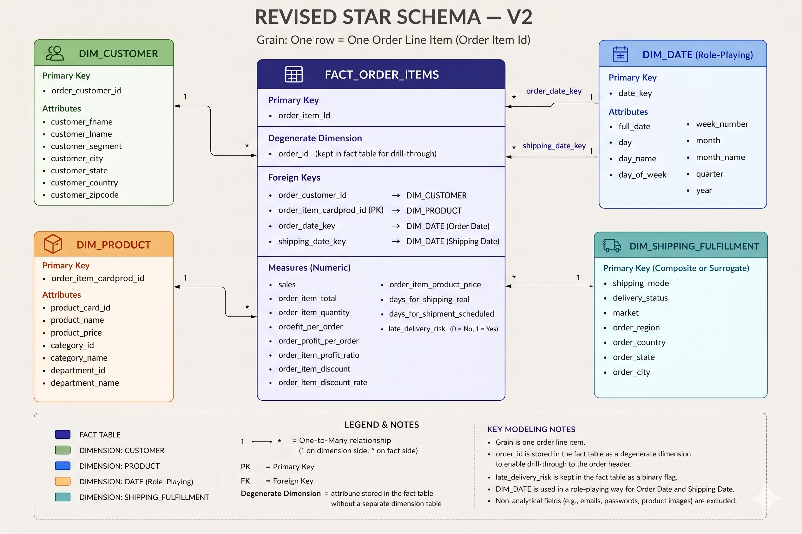

# Supply Chain Control Tower — P1: Descriptive Analytics & Data Warehouse

**Project 1 of 3** in a progressive Data Science portfolio built on the DataCo Smart Supply Chain dataset.

---

## Key findings

Analysis of 180,519 order items reveals:

- **Only 45.17% of orders are delivered on-time-in-full (OTIF).** More than half miss the fulfillment target.
- **Premium shipping is the least reliable.** First Class has the *highest* late-delivery rate of all shipping modes — the opposite of what customers paying for it would expect.
- **Discounting doesn't explain the margin problem.** Discount rate has near-zero correlation with profit margin at the order level (OLS regression, R² = 0.000), and loss-making orders aren't concentrated in high-discount bands. Profit erosion comes from elsewhere in the cost structure, not pricing.
- **Late delivery is systemic, not regional.** The late-delivery rate sits around 55% across every market and customer segment. The fix is operational, not a problem with one geography.

Full write-up: [`docs/executive_summary.pdf`](docs/executive_summary.pdf) · [`docs/business_findings.pdf`](docs/business_findings.pdf) · [`docs/technical_case_study.pdf`](docs/technical_case_study.pdf)

---

## What this project does

Transforms 180,519 raw supply chain order records into a clean PostgreSQL star schema warehouse, then surfaces the findings above through a Power BI dashboard and a Python EDA notebook.

---

## Stack

| Layer | Tool |
|---|---|
| Warehouse | PostgreSQL 16 |
| Transformation | SQL (pure — no dbt) |
| Analysis | Python (pandas, matplotlib, seaborn, statsmodels) |
| Visualization | Power BI Desktop |

---

## Star schema



**Grain:** 1 row = 1 order item (`order_item_id`)

| Table | Rows | Key design decision |
|---|---|---|
| `fact_order_fulfillment` | 180,519 | Degenerate dimension: `order_id` kept in fact |
| `dim_date` | 1,132 | Role-playing: same table for order date and shipping date |
| `dim_customer` | 20,652 | Market dropped — order-level attribute, not customer-level |
| `dim_product` | 118 | Category + department denormalized (MVP) |
| `dim_shipping_fulfillment` | 16,606 | SERIAL surrogate key — no natural key exists |

---

## SQL scripts

Run in order:

```
sql/
├── 00_validation_raw_data.sql       # Phase 1 — grain check, date validation
├── 01_dim_date.sql                  # Phase 2 — date dimension
├── 02_dim_customer.sql              # Phase 2 — customer dimension
├── 03_dim_product.sql               # Phase 2 — product dimension
├── 04_dim_shipping_fulfillment.sql  # Phase 2 — shipping/fulfillment dimension
├── 05_fact_order_fulfillment.sql    # Phase 2 — fact table
└── 06_warehouse_validation.sql      # Phase 3 — row count, RI, business logic
```

Each script includes investigation queries and documented decisions alongside the DDL/DML.

---

## Notebooks

`notebooks/01_eda_supply_chain.ipynb` — exploratory analysis behind the findings above: negative-profit orders, delivery time distribution by shipping mode, discount rate vs. profit margin correlation, and the OLS regression on profit ratio drivers.

Connects to the warehouse via environment variables (never hardcoded):

```bash
export DB_USER=your_local_user
export DB_NAME=order_fulfillment
# optional, default shown:
export DB_HOST=localhost
export DB_PORT=5432
```

---

## Documentation

| Document | Audience |
|---|---|
| [`docs/executive_summary.pdf`](docs/executive_summary.pdf) | Non-technical — business findings and recommendations |
| [`docs/business_findings.pdf`](docs/business_findings.pdf) | Detailed findings behind the KPIs |
| [`docs/technical_case_study.pdf`](docs/technical_case_study.pdf) | Technical — architecture and design decisions |

---

## Setup

**Prerequisites:** PostgreSQL 16, Python 3.10+

```bash
# 1. Clone
git clone https://github.com/franmerchan2-alt/supply-chain-control-tower.git
cd supply-chain-control-tower

# 2. Python environment
python -m venv venv
source venv/bin/activate        # Windows: venv\Scripts\activate
pip install -r requirements.txt

# 3. Data
# Download DataCo dataset from Kaggle — see data/README.md
# Load into PostgreSQL as supply_chain.raw_dataco

# 4. Run SQL scripts in order (00 → 06)

# 5. Set DB_USER / DB_NAME (see Notebooks section) and run the EDA notebook
```

---

## Dashboard

Power BI dashboard connected to the PostgreSQL warehouse. Screenshots in `dashboard/screenshots/`.

---

## Part of a 3-project portfolio

| Project | Focus | Status |
|---|---|---|
| P1 — Supply Chain Control Tower | Descriptive analytics + warehouse | ✅ Complete |
| P2 — Predictive Operations Analytics | Demand forecasting + lead-time risk (scikit-learn, statsmodels) | 🔜 Next |
| P3 — Optimization & Decision Models | Route + inventory optimization (OR-Tools) | 📋 Planned |

---

## License

MIT — see [LICENSE](LICENSE).
